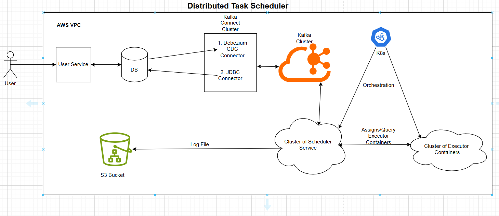

# Distributed-Task-Scheduler

## Architecture Diagram

Basic Requirements:
 - All tasks must be executed at the scheduled time, before the permitted delays.
 - The status and logs must be accessible.

Language/Framework: Java/SpringBoot  
Database: Postgres  
Messaging Queue: Kafka  
Cloud/DevOps: AWS, Linux, Docker, Kubernetes  

There're 3 components of this system:
1. User-Service -> For user interaction and CRUD for tasks on DB.
2. Scheduler-Engine -> Polls DB at regular intervals for tasks, and pass the tasks to the worker-nodes.
3. Worker-Node -> The component that's responsible for executing tasks.

## 1. User-Service
 - Exposes endpoints to the user, for user-management and various CRUD operations on Task Tables.
 - Performs necessary checks for the Tasks submitted by the user, and also Authenticate/Authorize users.
 - Users can query the results of their tasks, and access relevant logs.
 
## 2. Scheduler-Engine
 - Poll Database at a regular interval for upcoming scheduled tasks.
 - Makes the necessary checks and publish tasks on the relevant kafka topic's partition.
 - Updates the Database with the results of the task execution.
 - Looks after the recovery of the tasks, missed by service/DB outage, upon startup of the service.
 
## 3. Worker-Node
 - Listens to Kafka's Topic-Partition for receiving Task to the worker-node.
 - Runs a Container for each task, with the provided details, to ensure safety and isolation.
 
#### Refer each component's README.md file for details of that component.