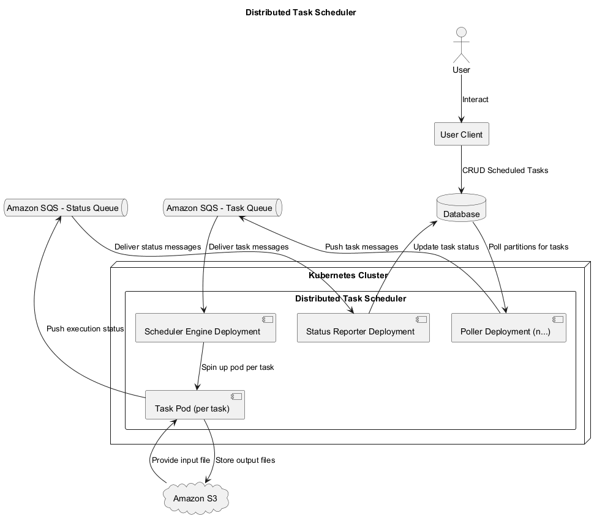

# Distributed-Task-Scheduler

## Architecture Diagram

Basic Requirements:
 - All tasks must be executed at the scheduled time, before the permitted delays.
 - The status and logs must be accessible.

Language: Golang  
Database: Postgres  
Messaging Queue: AWS SQS(Simple Queue Service)
Cloud/DevOps: AWS Storage(S3), Kubernetes

There are four components in this system:
1. User-Service → For user interaction and CRUD for tasks on DB.
2. Poller → Polls a specific partition of a table in the DB for upcoming tasks.
3. Scheduler-Engine → Receives the scheduled tasks from SQS 30 seconds before the scheduled time, and spins up the pod with requirements.
4. Status-Reporters → Updates the status of the message in the DB.

## 1. User-Service
 - Exposes endpoints to the user, for user-management and various CRUD operations on Task Tables.
 - Performs necessary checks for the Tasks submitted by the user, and also Authenticate/Authorize users.
 - Users can query the results of their tasks, and access relevant logs.

## 2. Poller
 - Poller service polls a specific TablePartitions per instance for scheduled tasks, `x` mins before their scheduled_time.
 - The poller service adds a visibility delay of (x - 30) seconds to the tasks being pushed in the queue.

## 3. Scheduler-Engine
 - Receives the scheduled tasks from SQS 30 seconds before the scheduled time, and spins up the pod with requirements.

## 4. Status-Reporters
 - Polls the Status Queue of the SQS for status updates of the executed tasks.
 - Publishes the message to the required table.
